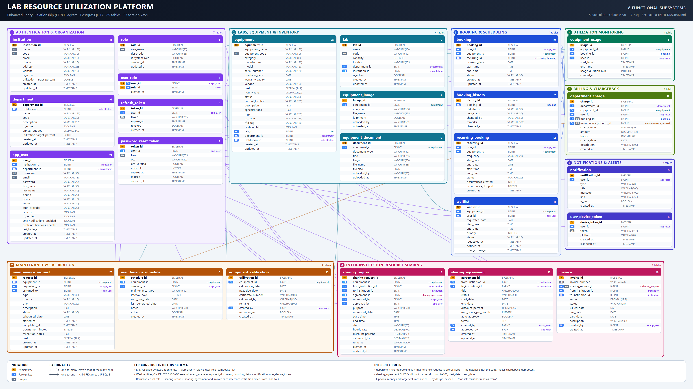

# Lab Resource Utilization Platform — Setup & Run Guide

A full-stack Lab Resource Utilization Platform for managing, scheduling, and monitoring laboratory equipment across departments and institutions.

## 🏗️ Tech Stack

**Backend:** Spring Boot 3.5.16 (Java 17), PostgreSQL, Spring Security + JWT, JavaMailSender  
**Frontend:** React 19 + Vite, Tailwind CSS 4, Axios, Framer Motion, Recharts

---

## 📋 Prerequisites

- **Java 17+** (run `java -version`)
- **Node.js 18+** (run `node -v`)
- **PostgreSQL 14+** installed and running
- **Gmail App Password** (optional, for email OTP — instructions below)

---

## 🚀 Quick Start

### 1. Database Setup

```bash
# Create the database
psql -U postgres
CREATE DATABASE lab_resource_db;
\q

# Run schema + seed scripts (in order)
cd e:/lab-resource-platform/database
psql -U postgres -d lab_resource_db -f 01_schema_auth.sql
psql -U postgres -d lab_resource_db -f 02_schema_institution_equipment.sql
psql -U postgres -d lab_resource_db -f 03_schema_booking.sql
psql -U postgres -d lab_resource_db -f 04_seed_data.sql
psql -U postgres -d lab_resource_db -f 05_migration_otp_oauth.sql
psql -U postgres -d lab_resource_db -f 06_migration_roles_equipment_inventory.sql
# More migration files added by the workflow (07-10) — run them too
```

### 2. Backend Configuration

```bash
cd e:/lab-resource-platform/backend

# Copy .env.example to .env and fill in your values
cp .env.example .env
```

Edit `backend/.env`:
```env
DB_PASSWORD=your_postgres_password
MAIL_USERNAME=
MAIL_PASSWORD=
```

**Get a Gmail App Password:**
1. Google Account → Security → 2-Step Verification → **App Passwords**
2. Create one for "Mail", copy the 16-character code (remove spaces)
3. Paste into `MAIL_PASSWORD` above

### 3. Frontend Configuration

```bash
cd e:/lab-resource-platform/frontend

# Copy .env.example to .env
cp .env.example .env
```

Edit `frontend/.env` (defaults are fine for local dev):
```env
VITE_API_BASE_URL=http://localhost:8080/api
VITE_GOOGLE_CLIENT_ID=   # Optional — leave blank for now
```

### 4. Start the Backend

```bash
cd e:/lab-resource-platform/backend
./mvnw spring-boot:run
```

Backend runs at **http://localhost:8080**

**First-run account.** No sample labs, equipment or bookings are seeded — you enter your
own. On an empty database the backend creates exactly three rows, because the schema
cannot work without them (`app_user.institution_id` and `department_id` are `NOT NULL`,
and only an existing admin can grant roles):

- one institution, one department, and one admin — username `admin` / password `admin123`

Name them yours *before* the first run via the `app.bootstrap.*` properties in
`backend/src/main/resources/application.properties` (or the matching `BOOTSTRAP_*`
environment variables). Each is created only when its table is empty, so renaming from
the UI afterwards is permanent. Change the admin password from Profile → Change Password.

**Starting over.** To wipe every row and build the system up yourself, run the reset tool
from the project root and restart the backend:

```bash
psql -U postgres -d lab_resource_db -f database/tools/reset_operational_data.sql
```

It preserves only the `role` table. It lives in `database/tools/` rather than `database/`
because Docker Compose auto-runs everything in `database/` on first start.

### 5. Start the Frontend

```bash
cd e:/lab-resource-platform/frontend
npm install
npm run dev
```

Frontend runs at **http://localhost:5173**

---

## 🐳 Run with Docker (one command)

Prefer the full stack in containers? You don't need local Java, Node, or Postgres.

```bash
# From the project root
cp .env.docker.example .env      # fill in JWT_SECRET (and mail creds if you want email)
docker compose up --build
```

- Frontend (Nginx) → **http://localhost:3000**
- Backend (Spring Boot) → **http://localhost:8080**
- PostgreSQL → **localhost:5433** (host port)

Nginx serves the built React app and proxies `/api` and `/uploads` to the backend,
so the browser talks to a single origin (no CORS in production). The `database/*.sql`
migrations run automatically the first time the Postgres volume is created.

Stop and remove everything (including the database volume):

```bash
docker compose down -v
```

---

## 🚀 Production deployment (Docker + cloud)

Full step-by-step guide: **[DEPLOYMENT.md](DEPLOYMENT.md)** — AWS EC2, Azure VM, Azure
Container Apps, TLS, backups, CD wiring and a troubleshooting table.

The short version. On any Docker host — an EC2 instance, an Azure VM, or a droplet:

```bash
git clone https://github.com/badalsingh25/lab-resource-platform.git
cd lab-resource-platform
cp .env.prod.example .env && chmod 600 .env
nano .env                    # POSTGRES_PASSWORD, JWT_SECRET, BOOTSTRAP_ADMIN_PASSWORD
docker compose -f docker-compose.prod.yml up -d
```

`docker-compose.prod.yml` differs from the dev stack above in ways that matter once the
host has a public address:

- **Only Nginx is published.** Postgres and the API get no host ports, so a port scan of
  the VM finds one open service instead of three.
- **Secrets are mandatory** (`${VAR:?}`) — compose refuses to start rather than falling
  back to a development default.
- **Health checks + `restart: always`**, so the stack comes back after a reboot and the
  CD job can tell a slow start from a failed one.
- **Log rotation**, so a long-running VM can't fill its disk with container logs.

Images are built and pushed to GHCR by `.github/workflows/deploy.yml` on every push to
`main`, tagged both `latest` and the commit SHA:

- `ghcr.io/badalsingh25/lab-resource-platform-backend:latest`
- `ghcr.io/badalsingh25/lab-resource-platform-frontend:latest`

That workflow then SSHes into the cloud host and rolls the stack onto the new SHA, once
the `DEPLOY_*` secrets are configured. Without them it reports "skipped" and passes.

The production profile (`application-prod.properties`, activated by compose) differs from
local dev in two ways that matter:

1. **Secrets have no fallbacks.** `DB_URL`, `DB_USERNAME`, `DB_PASSWORD`, `JWT_SECRET`
   and `BOOTSTRAP_ADMIN_PASSWORD` are required — a missing one stops startup rather than
   silently booting with the dev value committed to this repo. Generate a real signing
   key with `openssl rand -base64 48`.
2. **`ddl-auto=validate`.** Production schema comes from the numbered scripts in
   `database/`, applied in order. Hibernate only confirms the entities and tables agree
   and refuses to start if they don't, so an entity change that arrives without its
   migration fails the deploy instead of quietly altering a table holding real data.

Apply the migrations to a fresh production database before the first boot:

```bash
for f in database/[0-9]*.sql; do psql "$DB_URL" -v ON_ERROR_STOP=1 -f "$f"; done
```

---

## 🧪 Testing

**Backend** — 128 JUnit 5 + Mockito tests (service rules + web-slice RBAC), including a
Spring context smoke test that parses every `@Query` at startup:

```bash
cd backend
./mvnw test
```

**Frontend** — 26 Vitest + React Testing Library tests (interceptor, auth service,
routing guard, UI components):

```bash
cd frontend
npm test
```

Both suites run automatically in CI on every push and pull request
(see `.github/workflows/ci.yml`).

---

## 📚 Modules Implemented

### ✅ Module 1: Authentication & Organization
- JWT login/register/refresh
- OTP-based password reset (email)
- 7-role RBAC (SYSTEM_ADMIN, INSTITUTION_ADMIN, DEPARTMENT_HEAD, LAB_MANAGER, LAB_TECHNICIAN, RESEARCHER, STUDENT)
- Institution/Department/Lab management

### ✅ Module 2: Equipment Inventory Management ⭐
**Status:** FULLY FUNCTIONAL  
**Features:**
- Equipment registration & cataloging (name, code, category, manufacturer, model, serial, cost, vendor, warranty, location)
- Multi-image upload with gallery (set primary, zoom, delete)
- Document upload (manuals, warranty PDFs, certifications) with preview/download
- JSON specifications (Processor, RAM, Voltage, Dimensions — freeform key-value pairs)
- Auto-generated QR code payload (for asset tagging)
- RFID tag field
- Equipment categorization (10 categories: Computers, Analytical, Medical, etc.)
- **6 statuses:** Available, In Use, Reserved, Under Maintenance, Out of Service, Retired, Lost
- Department & institution mapping (equipment belongs to Lab → Department → Institution)
- Calibration & certification record management (document upload with type tagging: CALIBRATION_CERTIFICATE)
- **Role-based access control** per your mentor's permission matrix:
  - SYSTEM_ADMIN: full CRUD + uploads + status changes
  - INSTITUTION_ADMIN, DEPARTMENT_HEAD, LAB_MANAGER: add/edit/delete
  - LAB_TECHNICIAN: add/edit + uploads + status updates
  - RESEARCHER, STUDENT: **view-only** (Add/Edit/Delete buttons auto-hide)
- Search + 5 filters (category, department, lab, status, manufacturer)
- CSV export
- Equipment Details page with image gallery, documents, specs, QR code, health score, warranty info, activity timeline
- Responsive enterprise UI (glass cards, status badges with your color spec)

**Frontend pages:**
- `/dashboard/equipment` — main inventory table
- `/dashboard/equipment/:id` — details page

### ✅ Module 3: Booking & Scheduling + Waitlist (100%)
- Booking status machine per spec: PENDING → CONFIRMED → IN_USE → COMPLETED (+ CANCELLED, REJECTED, NO_SHOW)
- Role-gated approval workflow (managers approve/reject; owner can cancel)
- Equipment status auto-sync (CONFIRMED → RESERVED, IN_USE → IN_USE, terminal → AVAILABLE)
- Waitlist with queue positions, auto-notify next in line when a slot frees, auto-convert on booking
- **Availability calendar** (FullCalendar month/week/day views, status-colored events, click-to-book)
- **Recurring bookings** (daily/weekly series up to 60 occurrences, conflict dates skipped & reported, cancel-series)
- **Booking audit trail** (every status change logged with actor + timestamp, timeline modal per booking)
- Booking page with My/All/Calendar/Waitlist tabs and per-role action buttons

### ✅ Module 4: Utilization Monitoring
- Usage sessions recorded automatically from booking events (IN_USE opens, COMPLETED closes)
- Utilization rate per equipment (% of 08:00–20:00 capacity), department aggregation, top/bottom-5
- 7×12 day/hour heatmap, idle-equipment detection with configurable window
- `/dashboard/utilization` page: stat cards, heatmap, top-10 bar chart, idle alerts

### ✅ Module 5: Inter-Institution Resource Sharing (100%)
- Equipment "shareable" flag + cross-institution discovery (excludes your own institution)
- Request → approve/reject workflow (approver must belong to owning institution)
- Approval auto-creates a CONFIRMED booking for the requester (with conflict check + audit entry)
- **Usage fee / cost-sharing:** per-hour rate on shareable equipment, fee snapshot (rate × hours) on every request, live estimate in the request modal, fee chips on Discover cards
- `/dashboard/sharing` page: Discover / My Requests / Incoming tabs

### ✅ Google OAuth2 Login & Signup
- "Continue with Google" on Login and Register pages (official GIS button)
- Backend verifies ID tokens against Google tokeninfo (email_verified + aud checks)
- Auto-signup for new Google users (admin roles blocked); client ID configured in both .env files

### ✅ Module 6: Maintenance & Calibration (100%)
- Work order lifecycle: OPEN → ASSIGNED → IN_PROGRESS → COMPLETED (+ CANCELLED), with role/ownership gates
- Technician assignment (managers assign; techs see their queue with active-task counts)
- Equipment auto-set UNDER_MAINTENANCE while in progress, released on completion; **downtime auto-computed**
- Preventive maintenance schedules that **auto-generate work orders** when due (daily scheduled job)
- Calibration & certification records with next-due tracking and **automatic renewal reminders** (30-day horizon + overdue)
- `/dashboard/maintenance` page: Work Orders / Calibrations / Preventive Schedules tabs + summary stat cards

### ✅ Module 7: Notification & Alert System (100%)
- In-app notification hub with **live bell dropdown** (unread badge, mark-read / mark-all-read, click-through links)
- Persisted per user; polled every 60s; typed BOOKING / WAITLIST / SHARING / MAINTENANCE / CALIBRATION / BILLING / SYSTEM
- Wired into every flow: booking confirm/reject, waitlist slot freed, sharing approve/reject, work-order assign/complete, calibration reminders, invoice issued
- Email notifications continue via JavaMailSender (OTP, bookings, etc.). *(SMS/Twilio & Firebase push remain optional placeholders.)*

### ✅ Module 8: Analytics & Reporting (100%)
- **Role-aware intelligence dashboard** (`/dashboard/analytics`): one endpoint, tailored blocks
  - Everyone: my bookings/waitlist stats, upcoming bookings, personalised recommendations, equipment availability chart
  - Managers: pending approvals, no-show rate, high-demand equipment, open work orders, overdue calibrations
  - Admins: org utilization, department utilization bars, procurement/reallocation insights, sharing counts
- **Reports & exports** (`/dashboard/reports`): Utilization, Cost analysis, Maintenance/downtime, Billing — each exportable to **PDF (jsPDF)** and **Excel/CSV**

### ✅ Module 9: Cost & Billing (100%)
- Usage-based cost per equipment = booked hours × hourly rate; maintenance cost from completed work orders
- Department-wise cost allocation (aggregated + bar chart)
- **Inter-institution billing:** generate invoices from approved sharing requests, mark PAID / CANCELLED, receivable/payable summary
- `/dashboard/billing` page: Cost Analysis + Invoices tabs; billable-sharing shortcut to issue invoices

### ✅ Google OAuth2 Login & Signup
- "Continue with Google" on Login and Register pages (official GIS button)
- Backend verifies ID tokens against Google tokeninfo (email_verified + aud checks)
- Auto-signup for new Google users (admin roles blocked); client ID configured in both .env files

---

## 🗂️ Project Structure

```
lab-resource-platform/
├── backend/
│   ├── src/main/java/com/labresource/
│   │   ├── config/          # Security, CORS, file storage
│   │   ├── controller/      # REST endpoints
│   │   ├── dto/             # Request/Response DTOs
│   │   ├── entity/          # JPA entities
│   │   ├── event/           # Application events
│   │   ├── repository/      # Spring Data repos
│   │   ├── security/        # JWT filter, user details
│   │   ├── service/         # Business logic
│   │   └── exception/       # Custom exceptions
│   ├── .env                 # Environment vars (not committed)
│   └── pom.xml
├── frontend/
│   ├── src/
│   │   ├── pages/           # Route pages
│   │   ├── components/      # Reusable UI
│   │   ├── services/        # API clients
│   │   ├── context/         # Auth context
│   │   ├── layouts/         # Dashboard layout
│   │   ├── routes/          # React Router config
│   │   └── utils/           # Helpers (permissions, etc.)
│   ├── .env                 # Environment vars (not committed)
│   └── package.json
├── database/                # SQL schema + migrations (01 → 17, run in order)
│   ├── 01_schema_auth_organization.sql
│   ├── 02_schema_labs_equipment.sql
│   ├── 03_schema_booking.sql
│   ├── 04_seed_data.sql
│   ├── ... (05–17: OTP/OAuth, waitlist, utilization, sharing, maintenance, billing)
│   ├── EER_DIAGRAM.md       # Full entity-relationship diagram (25 tables)
│   └── tools/               # Dev utilities — not auto-run by Docker initdb
├── docker-compose.yml       # Local dev stack (all ports published)
├── docker-compose.prod.yml  # Production stack (only Nginx published)
├── .env.prod.example        # Production env template
├── DEPLOYMENT.md            # Docker + cloud deployment (AWS / Azure)
├── DOCUMENTATION.md         # Architecture, API reference, schema
├── PRESENTATION.md          # Demo walkthrough script
└── .github/workflows/       # ci.yml (tests) + deploy.yml (build, push, deploy)
```

---

## 🔐 Security Notes

- JWT tokens expire after 24h; refresh tokens after 7 days
- Passwords hashed with BCrypt
- CORS configured for `http://localhost:5173`
- Role-based method security with `@PreAuthorize`
- File uploads limited to 10MB
- `.env` files excluded from Git (see `.gitignore`)

---

## 🐛 Troubleshooting

### Login returns 403
- **Clear localStorage:** Browser DevTools → Application → Local Storage → delete all keys
- **Check backend logs** for token parse errors
- You can now log in with **username OR email**

### OTP email not arriving
- Check backend console for `[MAIL FALLBACK]` logs — the OTP is printed there if SMTP fails
- Verify `MAIL_PASSWORD` in `backend/.env` is your 16-char Gmail App Password (no spaces)
- Ensure 2-Step Verification is enabled on your Google account

### Backend won't start
- Verify PostgreSQL is running: `psql -U postgres -c "SELECT version();"`
- Check `DB_PASSWORD` in `backend/.env` matches your postgres password
- Run `./mvnw clean install -DskipTests` to rebuild

### Frontend shows network errors
- Ensure backend is running at `http://localhost:8080`
- Check `VITE_API_BASE_URL` in `frontend/.env`

---

## 📝 API Documentation

The backend exposes RESTful APIs at `http://localhost:8080/api`:

### Authentication (`/api/auth/*` — public)
- `POST /auth/register` — register new user
- `POST /auth/login` — login (returns JWT + refresh token)
- `POST /auth/refresh-token` — refresh expired JWT
- `POST /auth/forgot-password` — request OTP
- `POST /auth/verify-otp` — verify OTP (returns reset session token)
- `POST /auth/reset-password` — set new password
- `POST /auth/google` — Google OAuth2 login (coming soon via workflow)

### Equipment (`/api/equipment` — authenticated)
- `GET /equipment` — list with pagination + filters
- `GET /equipment/{id}` — details
- `POST /equipment` — create (roles: SYSTEM_ADMIN, INSTITUTION_ADMIN, DEPARTMENT_HEAD, LAB_MANAGER, LAB_TECHNICIAN)
- `PUT /equipment/{id}` — update (same roles)
- `DELETE /equipment/{id}` — delete (same roles)
- `PATCH /equipment/{id}/status` — change status (SYSTEM_ADMIN, LAB_MANAGER, LAB_TECHNICIAN)
- `POST /equipment/{id}/upload-image` — upload image (SYSTEM_ADMIN, LAB_TECHNICIAN)
- `POST /equipment/{id}/upload-document` — upload document (SYSTEM_ADMIN, INSTITUTION_ADMIN, LAB_TECHNICIAN)
- `DELETE /equipment/images/{imageId}` — delete image
- `DELETE /equipment/documents/{documentId}` — delete document
- `PUT /equipment/images/{imageId}/primary` — set primary image

### Bookings, Utilization, Sharing, Maintenance, Billing, Notifications, Analytics
All modules are implemented and functional. See **[DOCUMENTATION.md](DOCUMENTATION.md)**
for the complete endpoint reference and architecture overview.

---

## 🗄️ Database schema



25 tables across 8 subsystems, 272 columns, 53 foreign keys.

| | |
|---|---|
| [database/eer-diagram-4k.png](database/eer-diagram-4k.png) | 3840 × 2160 raster — print/slide quality |
| [database/eer-diagram.svg](database/eer-diagram.svg) | vector source, scales without loss |
| [database/EER_DIAGRAM.md](database/EER_DIAGRAM.md) | Mermaid diagrams + a 48-row cardinality table with every FK column and delete rule |

The image is generated from a schema model in
[database/tools/generate_eer_diagram.mjs](database/tools/generate_eer_diagram.mjs), so
column lists, keys and relationship counts are computed rather than drawn by hand:

```bash
node database/tools/generate_eer_diagram.mjs     # → eer-diagram.svg (+ .html wrapper)
```

Rasterize the SVG with headless Chrome (`--window-size=3840,2160`), or ImageMagick — the
exact commands are in the script header.

---

## 🤝 Contributing

This project follows:
- **Backend:** Spring Boot conventions, Lombok builders, constructor injection, `@Transactional` services
- **Frontend:** React 19 + plain JSX (no TypeScript), Tailwind utility classes, lucide-react icons
- **Git:** feature branches, descriptive commits with Co-Authored-By: Claude Opus 4.8

---

**Built with Claude Code + Ultracode mode** 🚀
