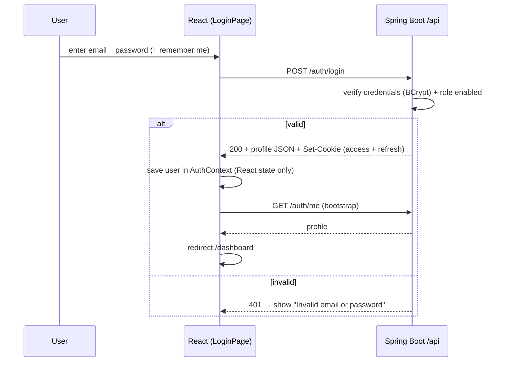
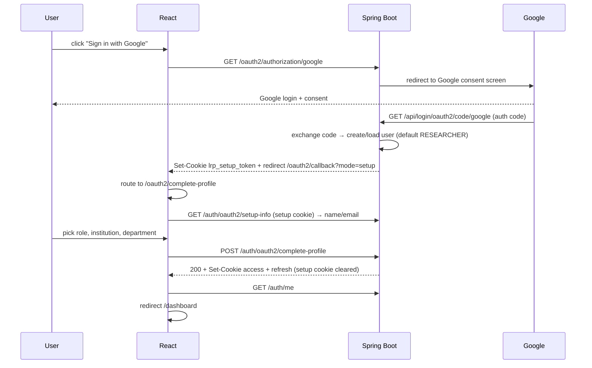
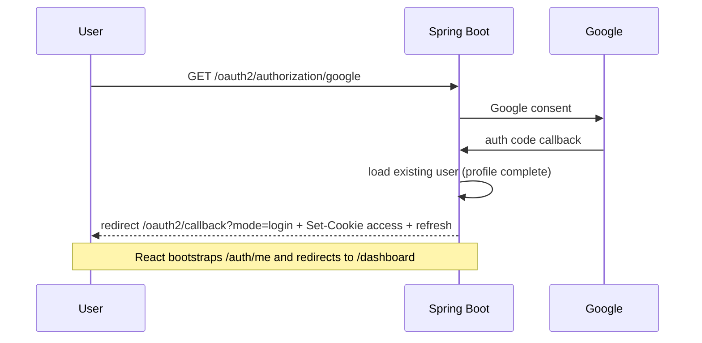
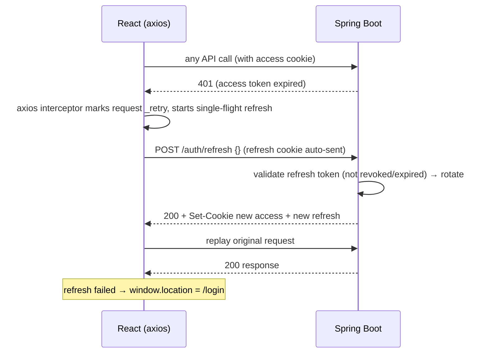

# Lab Resource Utilization Platform (LRUP)

A full-stack **Enterprise Lab Resource Management System** that lets research institutions, universities, and laboratories centrally manage laboratory equipment — from inventory and booking to maintenance, cost tracking, and cross-institution sharing.

- **Frontend:** React 18 + Vite (SPA, role-based UI)
- **Backend:** Spring Boot 3.3 (REST API, modular monolith)
- **Auth:** JWT in httpOnly cookies + Google OAuth2 (role-based access)
- **Database:** PostgreSQL (prod, Flyway) / H2 (dev, auto-seeded)

---

## Table of Contents

1. [Overview](#1-overview)
2. [Key Features](#2-key-features)
3. [Tech Stack](#3-tech-stack)
4. [System Architecture & Data Flow](#4-system-architecture--data-flow)
5. [Authentication & Login Flows](#5-authentication--login-flows)
6. [User Roles & Permissions](#6-user-roles--permissions)
7. [Key Business Workflows](#7-key-business-workflows)
8. [Project Structure](#8-project-structure)
9. [Database](#9-database)
10. [Getting Started (Local Development)](#10-getting-started-local-development)
11. [Running with Docker](#11-running-with-docker)
12. [API Documentation](#12-api-documentation)
13. [Testing](#13-testing)
14. [Security](#14-security)
15. [Related Documents](#15-related-documents)
16. [License](#16-license)

---

## 1. Overview

Labs invest heavily in expensive equipment that often sits under-utilized. LRUP solves this by providing a **centralized intelligence dashboard** to:

- Manage the complete **equipment inventory** (categories, tags, specs, QR codes, documents, images).
- **Schedule & book** equipment with a calendar, approvals, waitlist, and utilization-aware availability.
- Track **real-time utilization** and generate **analytics** (peak hours, utilization rate, idle alerts).
- Run **maintenance & calibration** cycles with service schedules and certificate management.
- Share resources **across departments and institutions** (partnerships, shared equipment, external requests).
- Handle **cost & billing** — invoices, payments, budgets, and cost breakdowns.
- Notify users via **email / in-app / SMS (stub) / push (stub)** for bookings, maintenance, and alerts.

---

## 2. Key Features

| Module | What it does |
|--------|--------------|
| **Authentication & RBAC** | JWT (httpOnly cookies) + Google OAuth2; 7 roles; role-config can disable roles at runtime |
| **Equipment Inventory** | CRUD, categories, tags, JSON specs, image upload, QR code generation, search & filter |
| **Booking & Scheduling** | Calendar view, approval workflow, waitlist, recurrence (daily/weekly/biweekly/monthly), 08:00–18:00 slots, conflict detection |
| **Utilization Monitoring** | Utilization rate per equipment/department, idle-equipment alerts, peak-hour analysis |
| **Resource Sharing** | Shared equipment with hourly/daily rates, external booking requests, inter-institution partnerships |
| **Maintenance & Calibration** | Work orders (preventive/corrective/calibration/emergency), assign & track status, service schedules, calibration certificates (PDF) |
| **Cost & Billing** | Invoices (auto-generated from completed bookings), payments (mock gateway), department budgets, cost & revenue analytics |
| **Notifications** | Email (Gmail SMTP), in-app, SSE stream + 30s polling fallback, SMS/push stub; per-type channel preferences |
| **Analytics Dashboard** | Global / institution / department scoped dashboards with charts (utilization, bookings, distribution) |
| **Reports & Export** | Excel (Apache POI), PDF (iText), CSV; report history & download |
| **Admin & Governance** | User management, role management, audit logs, announcements, system health monitoring |

---

## 3. Tech Stack

### Backend — `lab-resource-backend`

| Layer | Technology |
|-------|-----------|
| Language | **Java 17** |
| Framework | **Spring Boot 3.3.0** (modular monolith, REST) |
| Security | Spring Security, **JWT (jjwt 0.12.6)**, Google **OAuth2**, BCrypt |
| Persistence | Spring Data JPA / Hibernate 6.5, **Flyway** migrations |
| Database | **PostgreSQL** (prod) / **H2** (dev, PostgreSQL-compat mode) |
| Realtime | WebSocket/STOMP (SockJS), Server-Sent Events (SSE) |
| Docs | springdoc **Swagger UI / OpenAPI 3** |
| Utilities | Lombok, MapStruct, ZXing (QR codes), Apache POI (Excel), iText (PDF) |
| Email / SMS | JavaMail (Gmail SMTP), SMS stub (Twilio-ready) |
| Testing | JUnit 5, Spring Security Test, **Testcontainers** (PostgreSQL) |
| Observability | Request metrics + rate-limit interceptors, AOP audit log |

### Frontend — `lab-resource-frontend`

| Layer | Technology |
|-------|-----------|
| Framework | **React 18.3** (no TypeScript) |
| Build | **Vite 5** |
| Routing | React Router 6 |
| Server state | **TanStack Query 5** (useQuery / useMutation / cache invalidation) |
| Forms | react-hook-form + **zod** validation |
| HTTP | **axios** (withCredentials, 401 → refresh interceptor) |
| Styling | **Tailwind CSS 3** (custom component classes, no UI library) |
| Charts | **recharts** (pie / bar / line) |
| Calendar | **FullCalendar** (day / week / month) |
| Extras | lucide-react icons, react-hot-toast, SSE notifications |

### DevOps

| Tool | Purpose |
|------|---------|
| Docker + docker-compose | Postgres 16, Redis 7, backend (Temurin 17), frontend (nginx) |
| nginx | SPA static hosting + reverse proxy `/api` → backend |

---

## 4. System Architecture & Data Flow

```
┌─────────────────┐      /api (proxied)      ┌──────────────────────────┐      JDBC       ┌─────────────┐
│   Browser (SPA) │ ────────────────────────►│   Spring Boot :8081       │ ───────────────►│ PostgreSQL  │
│   React 18      │ ◄────────────────────────│   (context path: /api)    │ ◄───────────────│  (prod)     │
│   Vite :3000    │   JSON + httpOnly cookies│                           │                  │  or H2 (dev)│
└─────────────────┘                          └──────────────────────────┘                  └─────────────┘
    dev: Vite proxy                          layered as:
    prod: nginx 80 ──► backend:8081          Controller → Service → Repository → JPA Entity
```

### Frontend data flow

```
User action → Route (React Router) → Page component
            → useQuery / useMutation (TanStack Query) → axios (/api) → Spring Boot REST
            → response cached in QueryClient → UI re-renders (invalidate → refetch)
```

### Backend request flow

```
HTTP Request
  → Filter chain (CORS → JwtAuthenticationFilter → RateLimit → Metrics)
  → @RestController (validates DTO via @Valid)
  → @Service (business logic + @Transactional)
  → @Repository (Spring Data JPA)
  → Entity → Hibernate → Database
  → @RestControllerAdvice GlobalExceptionHandler (consistent error JSON on failure)
  → JSON response (+ httpOnly auth cookies when applicable)
```

Cross-cutting concerns: **AuditAspect** (@Auditable methods → `audit_logs`), **RateLimitInterceptor** (60 req/min per IP), **RequestMetricsInterceptor**, scheduled jobs (`NotificationScheduler`, retry-queue processor).

---

## 5. Authentication & Login Flows

Authentication is **stateless JWT delivered exclusively through httpOnly cookies** — tokens never touch JavaScript or `localStorage`.

| Cookie | Path | Lifetime | Purpose |
|--------|------|----------|---------|
| `lrp_access_token` | `/` | 1 hour | Authenticates API calls |
| `lrp_refresh_token` | `/api/auth` | 7 days (or browser session) | Obtains new access tokens; **rotated on every refresh** |
| `lrp_setup_token` | `/` | 10 minutes | Completes profile for first-time OAuth users |

All cookies are `HttpOnly` + `SameSite=Strict` (+ `Secure` behind HTTPS).

---

### Flow 1 — Email/Password Login



1. User opens **`/login`** and submits email, password, and an optional **"Remember me"** checkbox.
2. Frontend calls `POST /api/auth/login`.
3. Backend verifies the credentials with **BCrypt** and checks the role is enabled (`role_config`).
4. On success the server responds with **two `Set-Cookie` headers**:
   - `lrp_access_token` (path `/`, 1 h, HttpOnly, SameSite=Strict)
   - `lrp_refresh_token` (path `/api/auth`, 7 days if "Remember me", otherwise a session cookie)
   - A row is stored in `refresh_tokens` so the token can be revoked.
   - The JSON body contains **profile data only** (no tokens).
5. `AuthContext.login()` saves the user object in **React state** (nothing in `localStorage`).
6. The app calls `GET /api/auth/me` to confirm the session and routes the user to `/dashboard`.

---

### Flow 2 — Google OAuth2 Login (NEW user → role selection)



1. User clicks **"Sign in with Google"** on `/login` → frontend navigates to `GET /api/oauth2/authorization/google`.
2. Spring Security redirects to **Google's consent screen**; after consent, Google redirects back to `/api/login/oauth2/code/google`.
3. `CustomOAuth2UserService` loads the Google profile, **auto-creates the user** (default role `RESEARCHER`), and checks the role is enabled.
4. Because the profile is incomplete, the success handler sets the `lrp_setup_token` cookie and redirects the browser to `/oauth2/callback?mode=setup`.
5. `OAuth2CallbackPage` sees `mode=setup` and routes to `/oauth2/complete-profile`.
6. `RoleSelectionPage` calls `GET /api/auth/oauth2/setup-info` (setup cookie) to show the Google name/email, then asks the user to choose **role, institution, and department** (or a custom institution).
7. The user submits → `POST /api/auth/oauth2/complete-profile`. The backend reads the setup cookie, updates the user, issues **access + refresh cookies**, and clears the setup cookie.
8. The app bootstraps via `/auth/me` and lands on `/dashboard`.

---

### Flow 3 — Google OAuth2 Login (EXISTING user)



1. Steps 1–3 identical to Flow 2, but the user already exists with a complete profile.
2. `OAuth2AuthenticationSuccessHandler` issues the **access + refresh cookies**, persists the refresh token, and redirects to `/oauth2/callback?mode=login`.
3. `OAuth2CallbackPage` waits for the `/auth/me` bootstrap and redirects straight to `/dashboard` — no role selection.

---

### Flow 4 — Silent Token Refresh (access token expires)



1. The access token expires after 1 h; the next API call returns **401**.
2. The **axios response interceptor** catches the 401 (skips auth-screen endpoints), marks the request, and calls `POST /api/auth/refresh` with an empty body — the browser sends the `lrp_refresh_token` cookie automatically because it is path-scoped to `/api/auth`.
3. The backend validates the refresh token in the DB (not revoked / not expired) and **rotates it**: the old token is revoked and a **new access + refresh pair** is issued as cookies.
4. Concurrent 401s share one refresh call (single-flight), and the original request is replayed with the new access cookie.
5. If refresh fails (token revoked/expired), the user is redirected to `/login`.

---

### Flow 5 — Session Restore (page reload / re-open tab)

```
App mount → AuthProvider → GET /api/auth/me (access cookie sent automatically)
  → 200: build user object → isAuthenticated = true → render protected routes
  → 401: interceptor tries /auth/refresh once → retry /me
  → still failing: isAuthenticated = false → show /login
```

The `loading` flag in `AuthContext` drives a spinner inside `ProtectedRoute` so the app never flashes the login page for an authenticated user.

---

### Flow 6 — Logout

```
User clicks "Logout"
  → AuthContext.logout() → POST /api/auth/logout
  → backend reads refresh token (cookie or X-Refresh-Token header)
  → revokes the row in refresh_tokens (server-side logout)
  → clears lrp_access_token + lrp_refresh_token + lrp_setup_token (Max-Age=0)
  → frontend clears user state → redirect /login
```

Logout is **server-side**: the refresh token is revoked in the database, so even a previously stolen cookie cannot be replayed.

---

### Flow 7 — Registration

1. User fills `/register` (name, email, password, role, institution/department).
2. Frontend calls `POST /api/auth/register` → 201 with a success message.
3. No cookies are set — the user then logs in via **Flow 1**.

---

### Flow 8 — Forgot / Reset Password

1. `/forgot-password` → `POST /api/auth/forgot-password` with the email → backend creates a **single-use** reset token and sends it asynchronously by email.
2. The link opens `/reset-password?token=...` → `POST /api/auth/reset-password` with token + new password.
3. The token is consumed (single-use); the user logs in with the new password via **Flow 1**.

---

## 6. User Roles & Permissions

| Role | Key capabilities |
|------|------------------|
| **SYSTEM_ADMIN** | Role management, audit logs, system health, user management, everything below |
| **INSTITUTION_ADMIN** | Users, institutions/departments/laboratories, announcements, budgets, invoices, payments |
| **LAB_MANAGER** | Booking approvals, equipment CRUD, maintenance, analytics, reports, costs, resource sharing |
| **DEPARTMENT_HEAD** | Manager-level access scoped to their department |
| **LAB_TECHNICIAN** | Maintenance work orders + calibration dashboards |
| **RESEARCHER** | Browse equipment, book, my bookings, waitlist, notifications, profile |
| **STUDENT** | Same as researcher |

Role-based access is enforced **twice**: on the frontend (route guards + filtered navigation in `Layout.jsx`) and on the backend (`@PreAuthorize("hasRole(...)")` + `role_config` runtime gating).

---

## 7. Key Business Workflows

### Booking lifecycle

```
Request → PENDING_APPROVAL → APPROVED → (start usage) IN_USE → (end usage) COMPLETED
   │                              │
   └── REJECTED                   └── CANCELLED / NO_SHOW / EXPIRED
```
- Completing a booking **auto-generates an invoice** from the actual usage hours × hourly rate.
- Users can join a **waitlist**; when a slot frees up, waitlisted users are promoted automatically.
- Conflicts are prevented at request time (overlapping slots rejected).

### Maintenance & calibration

```
MaintenanceRoute dashboard → create work order (type/priority/assignee)
  → status workflow (OPEN → ASSIGNED → IN_PROGRESS → COMPLETED)
  → equipment status auto-set to UNDER_MAINTENANCE
Calibration: record certificate + interval → next due date auto-computed → due reminders
  → renew & reissue certificate (PDF download)
```

### Inter-institution resource sharing

```
Institution A lists equipment as SHARED (hourly/daily rate, deposit)
  → partnership agreement with Institution B
  → Institution B submits EXTERNAL booking request
  → A approves → booking tracked + billed
```

### Notifications

```
Event (booking approved, calibration due, idle alert…) 
  → EmailService (async, Gmail SMTP) + in-app Notification row
  → SSE stream (ticket-protected) or 30s polling in the header
  → unread badge updates live; per-type channel preferences honored
```

Schedulers: booking reminders (daily 08:00), calibration-due (Mon 09:00), service-due (daily 08:15), idle-equipment alerts (Mon 10:00), retry-queue processor (every 30 min).

---

## 8. Project Structure

```
lab_resource_management/
├── lab-resource-backend/                 # Spring Boot REST API (:8081, /api)
│   ├── src/main/java/com/lrplatform/
│   │   ├── LrPlatformApplication.java    # entry point
│   │   ├── controller/                   # 22 REST controllers
│   │   ├── service/                      # 28 services + schedulers
│   │   ├── repository/                   # 28 Spring Data JPA interfaces
│   │   ├── model/entity/                 # 29 JPA entities
│   │   ├── model/enums/                  # UserRole, BookingStatus, …
│   │   ├── dto/request + dto/response    # validation + response shapes
│   │   ├── security/                     # JWT, cookies, OAuth2, SSE tickets
│   │   ├── config/                       # Security, WebSocket, Swagger, seeder…
│   │   ├── exception/                    # GlobalExceptionHandler
│   │   ├── aspect/ + annotation/         # AOP audit logging
│   │   └── resources/
│   │       ├── application.yml           # dev (H2) / prod (PostgreSQL) profiles
│   │       └── db/migration/             # Flyway V1…V14
│   └── src/test/java/…                   # 64 controller/unit tests
│
├── lab-resource-frontend/                # React SPA (:3000, Vite)
│   └── src/
│       ├── main.jsx / App.jsx            # entry + routes + guards
│       ├── api/axiosConfig.js            # withCredentials + refresh interceptor
│       ├── api/api.js                    # grouped API methods
│       ├── context/AuthContext.jsx       # auth state + role helpers
│       ├── components/common/            # Layout, ErrorBoundary, Pagination
│       ├── pages/                        # auth/, dashboard/, equipment/, booking/,
│       │                                 # maintenance/, calibration/, admin/, reports/, …
│       ├── hooks/useNotificationWebSocket.js
│       └── styles/globals.css            # Tailwind + component classes
│
├── docker-compose.yml                    # postgres + redis + backend + frontend
├── PRD_Lab_Resource_Utilization_Platform.md
├── TEST_REPORT.md / SECURITY_REPORT.md / DEPLOYMENT_PLAN.md
└── README.md
```

---

## 9. Database

| Environment | Database | Schema | Flyway |
|-------------|----------|--------|--------|
| **dev** (default) | H2 file (`./data/lrup`, PostgreSQL-compat mode) | `ddl-auto: update` | disabled; seeded by `DataSeeder` |
| **prod** | PostgreSQL | `ddl-auto: validate`-safe via Flyway | enabled (V1–V14) |
| **test** | Testcontainers PostgreSQL | — | — |

**Flyway migrations** (`db/migration/`): `V1__init_schema.sql` (full schema) → `V14__add_service_tracking_and_certificates.sql`, adding budgets, hourly rates, specs/tags, recurrence, report history, usage tracking, service cycles, etc.

**Key entities (29):** `User`, `RefreshToken`, `PasswordResetToken`, `RoleConfig`, `Institution`, `Department`, `Laboratory`, `Equipment`, `EquipmentCategory`, `EquipmentTag`, `EquipmentDocument`, `CalibrationRecord`, `Booking`, `BookingHistory`, `BookingWaitlist`, `MaintenanceWorkOrder`, `SharedEquipment`, `ExternalBookingRequest`, `InstitutionPartnership`, `Notification`, `NotificationPreference`, `NotificationRetryQueue`, `Invoice`, `Payment`, `DepartmentBudget`, `AuditLog`, `Announcement`, `ReportHistory`, `UsageLog`.

---

## 10. Getting Started (Local Development)

### Prerequisites

- **Java 17** + Maven 3.9+
- **Node.js 20+** + npm
- (Optional) Google Cloud OAuth app credentials for social login; Docker for `docker-compose`

### 1) Backend (Spring Boot, port **8081**)

```powershell
cd lab-resource-backend
# Optional: start via the guard script (requires env vars set first)
$env:GOOGLE_CLIENT_ID="..."          # from Google Cloud Console
$env:GOOGLE_CLIENT_SECRET="..."
.\start.ps1
# OR plain (OAuth login will be skipped / warn if creds missing):
mvn spring-boot:run
```

- Runs at **`http://localhost:8081/api`** (dev profile → H2 file DB, auto-seeded).
- **Important:** the dev H2 file DB allows **one process only** — stop the running instance before starting a second one.
- Swagger UI: `http://localhost:8081/api/swagger-ui.html`

### 2) Frontend (Vite, port **3000**)

```powershell
cd lab-resource-frontend
npm install
npm run dev
```

- Open **`http://localhost:3000`**.
- Vite proxies `/api` → `http://localhost:8081` (`changeOrigin: true`), so cookies work seamlessly in dev.

### Demo accounts (seeded automatically, password `Password@123`)

| Email | Role |
|-------|------|
| `admin@demouniversity.edu` | SYSTEM_ADMIN |
| `suresh@demouniversity.edu` | INSTITUTION_ADMIN |
| `priya@demouniversity.edu` | LAB_MANAGER |
| `meena@demouniversity.edu` | DEPARTMENT_HEAD |
| `rajesh@demouniversity.edu` | LAB_TECHNICIAN |
| `arun@demouniversity.edu` / `sneha@demouniversity.edu` | RESEARCHER |
| `selvakumark1059.sse@saveetha.com` | STUDENT |

### Environment variables

| Variable | Purpose |
|----------|---------|
| `GOOGLE_CLIENT_ID` / `GOOGLE_CLIENT_SECRET` | Google OAuth2 login (required for the Google button; app fails fast on the placeholder in non-dev) |
| `JWT_SECRET` | JWT signing key. If unset, a random key is generated at boot (all tokens invalid after restart) |
| `MAIL_USERNAME` / `MAIL_PASSWORD` | Gmail SMTP for email notifications |
| `SPRING_PROFILES_ACTIVE` | `dev` (default) or `prod` (PostgreSQL + Flyway) |

> **Never commit** `application-dev.yml`, `.env`, `start.ps1`, or `*.sql` backups — they may contain secrets (see `.gitignore`).

---

## 11. Running with Docker

```bash
docker-compose up --build
```

| Service | Port | Notes |
|---------|------|-------|
| `frontend` (nginx) | **80** | SPA + reverse proxy `/api` → backend |
| `backend` | **8081** | `SPRING_PROFILES_ACTIVE=prod`, connects to `postgres` |
| `postgres` | 5432 | Postgres 16, database `lrup` |
| `redis` | 6379 | Redis 7 (reserved for future caching/rate-limit store) |

> **Note:** the backend `Dockerfile` references a Maven wrapper (`mvnw`) that is not present in the repo. Until fixed (see `DEPLOYMENT_PLAN.md` §A.1), build the backend image with `mvn` directly, e.g. `mvn package -DskipTests` then adjust the Dockerfile, or build locally and run the JAR.

---

## 12. API Documentation

- Interactive docs: **`http://localhost:8081/api/swagger-ui.html`**
- OpenAPI JSON: **`http://localhost:8081/api/v3/api-docs`**
- 22 controllers cover: auth, profile, equipment, bookings, maintenance, notifications (+preferences), institutions/departments/laboratories, resource sharing, reports, payments, invoices, costs, budgets, analytics, admin dashboard/system/users/roles, audit logs, announcements.

---

## 13. Testing

| Check | Command | Result |
|-------|---------|--------|
| Backend unit/integration tests | `mvn test` (in `lab-resource-backend`) | ✅ 64 tests, 0 failures |
| Frontend production build | `npm run build` (in `lab-resource-frontend`) | ✅ success (2480 modules) |
| End-to-end verification | See `TEST_REPORT.md` | 332/340 baseline |

`AuthControllerTest` asserts cookie attributes (HttpOnly, SameSite, path) and that token fields never appear in JSON responses.

---

## 14. Security

- **JWT in httpOnly cookies** — `lrp_access_token` (1 h), `lrp_refresh_token` (7 d, path-scoped `/api/auth`, rotated on refresh), `lrp_setup_token` (10 min). All `HttpOnly` + `SameSite=Strict` (+ `Secure` over HTTPS). **No tokens in `localStorage`/`sessionStorage` or JS.**
- **Server-side logout** — refresh tokens are persisted in `refresh_tokens` and revoked on logout/rotation.
- **Google OAuth2** with role-config gating; BCrypt-hashed passwords.
- **RBAC** — `@PreAuthorize` on the backend + route guards on the frontend.
- **Audit logging** — AOP `@Auditable` writes who/what/when to `audit_logs`.
- **Rate limiting** (60 req/min/IP), request metrics, parameterized queries (no SQL injection), single-use password-reset tokens.
- CSRF disabled by design (stateless cookies mitigated by `SameSite=Strict`).

Full two-pass audit results and open items: **`SECURITY_REPORT.md`**.

---

## 15. Related Documents

| Document | Description |
|----------|-------------|
| `PRD_Lab_Resource_Utilization_Platform.md` | Full product requirements (roles, workflows, UI, acceptance criteria) |
| `TEST_REPORT.md` | End-to-end manual verification report |
| `SECURITY_REPORT.md` | Security audit findings, fixes, and verification evidence |
| `DEPLOYMENT_PLAN.md` | Netlify + Render + Neon deployment plan |

---

## 16. License

See [LICENSE](LICENSE).
