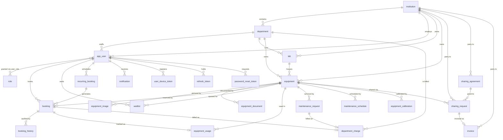

# EER Diagram — Lab Resource Utilization Platform

Generated from the 17 migration scripts in this directory. 25 tables.

GitHub renders the Mermaid blocks below directly. For an image, paste either block into
[mermaid.live](https://mermaid.live) and export PNG/SVG.

---

## 1. Overview — entities and relationships

---

## 2. Full diagram — all attributes

```mermaid
erDiagram
    institution {
        bigint    institution_id PK
        varchar   name UK
        varchar   code UK
        varchar   email
        varchar   phone
        varchar   address
        varchar   website
        boolean   is_active
        double    utilization_target_percent "NULL falls back to app default"
        timestamp created_at
        timestamp updated_at
    }

    department {
        bigint    department_id PK
        bigint    institution_id FK
        varchar   name
        varchar   code
        varchar   description
        boolean   is_active
        decimal   annual_budget "NULL means budget not tracked"
        double    utilization_target_percent
        timestamp created_at
        timestamp updated_at
    }

    role {
        bigint    role_id PK
        varchar   role_name UK "7-role RBAC model"
        varchar   description
        boolean   is_system_role
        timestamp created_at
        timestamp updated_at
    }

    app_user {
        bigint    user_id PK
        bigint    institution_id FK
        bigint    department_id FK
        varchar   username UK
        varchar   email UK
        varchar   password "BCrypt hash"
        varchar   first_name
        varchar   last_name
        varchar   phone "E.164 for SMS"
        varchar   gender
        varchar   status "ACTIVE INACTIVE SUSPENDED"
        varchar   auth_provider "LOCAL GOOGLE"
        boolean   is_active
        boolean   is_verified
        boolean   sms_notifications_enabled
        boolean   push_notifications_enabled
        timestamp last_login_at
        timestamp created_at
        timestamp updated_at
    }

    user_role {
        bigint    user_id PK,FK
        bigint    role_id PK,FK
        timestamp created_at
    }

    refresh_token {
        bigint    token_id PK
        bigint    user_id FK
        varchar   token UK
        timestamp expires_at
        boolean   revoked
        timestamp created_at
    }

    password_reset_token {
        bigint    token_id PK
        bigint    user_id FK
        varchar   token UK "issued after OTP verified"
        varchar   otp "6 digit"
        boolean   otp_verified
        int       attempts "max 5"
        timestamp expires_at
        boolean   is_used
        timestamp created_at
    }

    user_device_token {
        bigint    device_token_id PK
        bigint    user_id FK
        varchar   token UK "FCM registration token"
        varchar   platform "WEB ANDROID IOS"
        timestamp created_at
        timestamp last_seen_at
    }

    lab {
        bigint    lab_id PK
        varchar   name
        varchar   code UK
        int       capacity
        varchar   location
        bigint    department_id FK
        bigint    institution_id FK
        boolean   is_active
        timestamp created_at
        timestamp updated_at
    }

    equipment {
        bigint    equipment_id PK
        varchar   equipment_name
        varchar   equipment_code UK
        varchar   category
        varchar   manufacturer
        varchar   model
        varchar   serial_number
        date      purchase_date
        date      warranty_expiry
        varchar   vendor
        numeric   cost
        decimal   hourly_rate "NULL or 0 means free"
        varchar   status "AVAILABLE IN_USE RESERVED UNDER_MAINTENANCE OUT_OF_SERVICE LOST"
        varchar   current_location
        text      description
        text      specifications
        text      tags "comma separated lowercase"
        varchar   qr_code
        varchar   rfid_tag
        boolean   is_shareable
        bigint    lab_id FK
        bigint    department_id FK
        bigint    institution_id FK
        timestamp created_at
        timestamp updated_at
    }

    equipment_image {
        bigint    image_id PK
        bigint    equipment_id FK
        varchar   image_url
        varchar   file_name
        boolean   is_primary
        varchar   uploaded_by
        timestamp uploaded_at
    }

    equipment_document {
        bigint    document_id PK
        bigint    equipment_id FK
        varchar   document_type "MANUAL WARRANTY SPECIFICATION CALIBRATION OTHER"
        varchar   title
        varchar   file_url
        varchar   file_name
        bigint    file_size
        varchar   uploaded_by
        timestamp uploaded_at
    }

    booking {
        bigint    booking_id PK
        bigint    user_id FK
        bigint    equipment_id FK
        bigint    recurring_id FK "NULL for one-off bookings"
        date      booking_date
        time      start_time
        time      end_time
        varchar   status "PENDING CONFIRMED IN_USE COMPLETED CANCELLED NO_SHOW REJECTED"
        timestamp created_at
        timestamp updated_at
    }

    booking_history {
        bigint    history_id PK
        bigint    booking_id FK
        varchar   old_status "NULL on the creation entry"
        varchar   new_status
        varchar   changed_by
        varchar   remarks
        timestamp changed_at
    }

    recurring_booking {
        bigint    recurring_id PK
        bigint    user_id FK
        bigint    equipment_id FK
        varchar   frequency "DAILY WEEKLY"
        date      start_date
        date      end_date
        time      start_time
        time      end_time
        varchar   status "ACTIVE CANCELLED"
        int       occurrences_created
        int       occurrences_skipped
        timestamp created_at
    }

    waitlist {
        bigint    waitlist_id PK
        bigint    equipment_id FK
        bigint    user_id FK
        date      requested_date
        time      start_time
        time      end_time
        int       priority
        varchar   status "WAITING NOTIFIED CONVERTED EXPIRED CANCELLED"
        timestamp requested_at
        timestamp notified_at
        timestamp offer_expires_at "claim deadline"
    }

    equipment_usage {
        bigint    usage_id PK
        bigint    equipment_id FK
        bigint    booking_id FK
        bigint    user_id FK
        timestamp start_time
        timestamp end_time
        int       usage_duration_min
        timestamp created_at
    }

    sharing_agreement {
        bigint    agreement_id PK
        bigint    from_institution_id FK "granted access"
        bigint    to_institution_id FK "owns the equipment"
        varchar   title
        varchar   status "PROPOSED ACTIVE SUSPENDED EXPIRED TERMINATED"
        date      start_date
        date      end_date "NULL means open ended"
        decimal   discount_percent
        int       max_hours_per_month
        boolean   auto_approve
        text      terms
        bigint    created_by FK
        bigint    approved_by FK
        timestamp created_at
        timestamp updated_at
    }

    sharing_request {
        bigint    sharing_request_id PK
        bigint    equipment_id FK
        bigint    from_institution_id FK
        bigint    to_institution_id FK
        bigint    agreement_id FK "NULL for ad hoc requests"
        bigint    requested_by FK
        bigint    approved_by FK
        varchar   purpose
        date      requested_date
        time      start_time
        time      end_time
        varchar   status "PENDING APPROVED REJECTED CANCELLED COMPLETED"
        decimal   hourly_rate "rate snapshot"
        decimal   discount_percent
        decimal   estimated_fee
        varchar   remarks
        timestamp created_at
        timestamp updated_at
    }

    invoice {
        bigint    invoice_id PK
        varchar   invoice_number UK
        bigint    sharing_request_id FK,UK
        bigint    from_institution_id FK "issuer receives payment"
        bigint    to_institution_id FK "billed pays"
        decimal   amount
        varchar   status "PENDING PAID CANCELLED"
        date      issued_date
        date      due_date
        date      paid_date
        varchar   description
        bigint    created_by FK
        timestamp created_at
    }

    department_charge {
        bigint    charge_id PK
        bigint    department_id FK
        bigint    equipment_id FK
        bigint    user_id FK
        bigint    booking_id FK,UK "idempotency key for USAGE"
        bigint    maintenance_request_id FK,UK "idempotency key for MAINTENANCE"
        varchar   charge_type "USAGE MAINTENANCE"
        decimal   amount
        double    hours
        date      charge_date
        varchar   description
        timestamp created_at
    }

    maintenance_request {
        bigint    request_id PK
        bigint    equipment_id FK
        bigint    requested_by FK
        bigint    assigned_to FK
        varchar   type "PREVENTIVE CORRECTIVE CALIBRATION INSPECTION"
        varchar   priority "LOW MEDIUM HIGH CRITICAL"
        varchar   title
        varchar   description
        varchar   status "OPEN ASSIGNED IN_PROGRESS COMPLETED CANCELLED"
        date      scheduled_date
        timestamp started_at
        timestamp completed_at
        bigint    downtime_minutes
        varchar   resolution_notes
        decimal   cost
        timestamp created_at
        timestamp updated_at
    }

    maintenance_schedule {
        bigint    schedule_id PK
        bigint    equipment_id FK
        bigint    created_by FK
        varchar   maintenance_type "PREVENTIVE CALIBRATION INSPECTION"
        int       interval_days
        date      next_due_date
        date      last_generated_date
        varchar   notes
        boolean   active
        timestamp created_at
    }

    equipment_calibration {
        bigint    calibration_id PK
        bigint    equipment_id FK
        date      calibration_date
        date      next_due_date
        varchar   certificate_number
        varchar   calibrated_by
        varchar   remarks
        bigint    created_by FK
        boolean   reminder_sent
        timestamp created_at
    }

    notification {
        bigint    notification_id PK
        bigint    user_id FK
        varchar   type "BOOKING WAITLIST SHARING MAINTENANCE CALIBRATION BILLING SYSTEM"
        varchar   title
        varchar   message
        varchar   link
        boolean   is_read
        timestamp created_at
    }

    institution ||--o{ department        : "contains"
    institution ||--o{ app_user          : "employs"
    institution ||--o{ lab               : "owns"
    institution ||--o{ equipment         : "owns"
    department  ||--o{ app_user          : "staffs"
    department  ||--o{ lab               : "runs"
    department  ||--o{ equipment         : "owns"
    department  ||--o{ department_charge : "is billed"

    app_user ||--o{ user_role : ""
    role     ||--o{ user_role : ""

    app_user ||--o{ refresh_token        : ""
    app_user ||--o{ password_reset_token : ""
    app_user ||--o{ user_device_token    : ""
    app_user ||--o{ notification         : ""
    app_user ||--o{ booking              : "books"
    app_user ||--o{ waitlist             : "waits"
    app_user ||--o{ recurring_booking    : "schedules"
    app_user ||--o{ equipment_usage      : "operates"
    app_user ||--o{ department_charge    : "incurs"
    app_user ||--o{ maintenance_request  : "requests or is assigned"
    app_user ||--o{ maintenance_schedule : "creates"
    app_user ||--o{ equipment_calibration : "records"
    app_user ||--o{ sharing_request      : "requests or approves"
    app_user ||--o{ sharing_agreement    : "drafts or approves"
    app_user ||--o{ invoice              : "issues"

    lab ||--o{ equipment : "houses"

    equipment ||--o{ equipment_image       : ""
    equipment ||--o{ equipment_document    : ""
    equipment ||--o{ booking               : ""
    equipment ||--o{ waitlist              : ""
    equipment ||--o{ recurring_booking     : ""
    equipment ||--o{ equipment_usage       : ""
    equipment ||--o{ sharing_request       : ""
    equipment ||--o{ maintenance_request   : ""
    equipment ||--o{ maintenance_schedule  : ""
    equipment ||--o{ equipment_calibration : ""
    equipment ||--o{ department_charge     : ""

    recurring_booking   ||--o{ booking           : "generates"
    booking             ||--o{ booking_history   : "audited by"
    booking             ||--o| equipment_usage   : "tracked as"
    booking             ||--o| department_charge : "billed as"
    maintenance_request ||--o| department_charge : "billed as"

    sharing_agreement ||--o{ sharing_request   : "governs"
    sharing_request   ||--o| invoice           : "invoiced as"
    institution       ||--o{ sharing_request   : "from and to"
    institution       ||--o{ sharing_agreement : "from and to"
    institution       ||--o{ invoice           : "from and to"
```

---

## 3. Cardinality reference

| Parent | Child | Cardinality | FK column | On delete |
|---|---|---|---|---|
| institution | department | 1 : N | institution_id | restrict |
| institution | app_user | 1 : N | institution_id | restrict |
| institution | lab | 1 : N | institution_id | restrict |
| institution | equipment | 1 : 0..N | institution_id | restrict |
| institution | sharing_request | 1 : N ×2 | from_/to_institution_id | restrict |
| institution | sharing_agreement | 1 : N ×2 | from_/to_institution_id | cascade |
| institution | invoice | 1 : N ×2 | from_/to_institution_id | restrict |
| department | app_user | 1 : N | department_id | restrict |
| department | lab | 1 : N | department_id | restrict |
| department | equipment | 1 : 0..N | department_id | restrict |
| department | department_charge | 1 : N | department_id | cascade |
| app_user | role | M : N | via user_role | restrict |
| app_user | refresh_token | 1 : N | user_id | restrict |
| app_user | password_reset_token | 1 : N | user_id | restrict |
| app_user | user_device_token | 1 : N | user_id | cascade |
| app_user | notification | 1 : N | user_id | cascade |
| app_user | booking | 1 : N | user_id | restrict |
| app_user | waitlist | 1 : N | user_id | restrict |
| app_user | recurring_booking | 1 : N | user_id | restrict |
| app_user | equipment_usage | 1 : N | user_id | restrict |
| app_user | department_charge | 1 : 0..N | user_id | set null |
| app_user | maintenance_request | 1 : N ×2 | requested_by, assigned_to | restrict |
| app_user | maintenance_schedule | 1 : N | created_by | restrict |
| app_user | equipment_calibration | 1 : N | created_by | restrict |
| app_user | invoice | 1 : N | created_by | restrict |
| app_user | sharing_request | 1 : N ×2 | requested_by, approved_by | restrict |
| app_user | sharing_agreement | 1 : 0..N ×2 | created_by, approved_by | set null |
| lab | equipment | 1 : 0..N | lab_id | restrict |
| equipment | equipment_image | 1 : N | equipment_id | cascade |
| equipment | equipment_document | 1 : N | equipment_id | cascade |
| equipment | booking | 1 : N | equipment_id | restrict |
| equipment | waitlist | 1 : N | equipment_id | restrict |
| equipment | recurring_booking | 1 : N | equipment_id | restrict |
| equipment | equipment_usage | 1 : N | equipment_id | restrict |
| equipment | sharing_request | 1 : N | equipment_id | restrict |
| equipment | maintenance_request | 1 : N | equipment_id | restrict |
| equipment | maintenance_schedule | 1 : N | equipment_id | restrict |
| equipment | equipment_calibration | 1 : N | equipment_id | restrict |
| equipment | department_charge | 1 : 0..N | equipment_id | set null |
| recurring_booking | booking | 1 : N | recurring_id | restrict |
| booking | booking_history | 1 : N | booking_id | cascade |
| booking | equipment_usage | 1 : 0..1 | booking_id | restrict |
| booking | department_charge | 1 : 0..1 | booking_id (UNIQUE) | set null |
| maintenance_request | department_charge | 1 : 0..1 | request_id (UNIQUE) | set null |
| sharing_agreement | sharing_request | 1 : 0..N | agreement_id | set null |
| sharing_request | invoice | 1 : 0..1 | sharing_request_id (UNIQUE) | restrict |

---

## 4. EER constructs used

**M:N resolved into an associative entity.** `app_user` ↔ `role` is many-to-many; `user_role`
carries the composite primary key `(user_id, role_id)` and has no surrogate id of its own.

**Weak entities.** `equipment_image`, `equipment_document`, `booking_history` and
`user_device_token` have no meaning apart from their owner, which is why each cascades on
delete. `notification` is the same for `app_user`. Everything else is an independent entity
and restricts deletion.

**Role-based specialization.** Rather than subtype tables per user category, the seven roles
(SYSTEM_ADMIN, INSTITUTION_ADMIN, DEPARTMENT_HEAD, LAB_MANAGER, LAB_TECHNICIAN, RESEARCHER,
STUDENT) are rows in `role`. A user may hold several at once — a lab manager who also
researches — which subtype tables would not permit.

**Recursive / dual relationships.** `sharing_request`, `sharing_agreement` and `invoice` each
reference `institution` twice, once per side of the transaction. `sharing_agreement` carries a
CHECK forbidding `from = to`; a reciprocal arrangement is modelled as two rows so each
direction gets its own rate and quota.

**1:1 enforced by a unique FK.** `invoice.sharing_request_id`, `department_charge.booking_id`
and `department_charge.maintenance_request_id` are UNIQUE. On the two charge columns this is
also the idempotency guarantee: replaying a completion event cannot double-bill a department.

**Optional participation as a modelling choice.** `department.annual_budget`,
`equipment.hourly_rate` and both `utilization_target_percent` columns are nullable with no
default, because NULL means "not configured" and must report as such — a default of 0 would
render as a real budget of zero or a target of zero.

**Temporal specialization.** `booking` holds current state; `booking_history` holds the audit
trail of every status transition. `equipment_usage` records actual occupancy, which is what
utilization is computed from rather than from the reservation.
